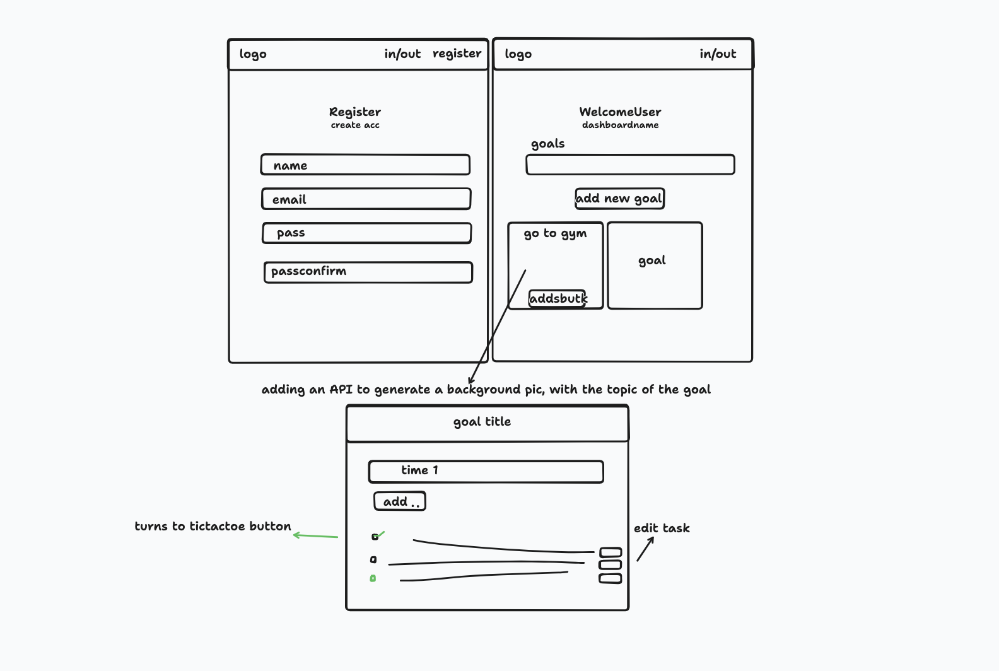
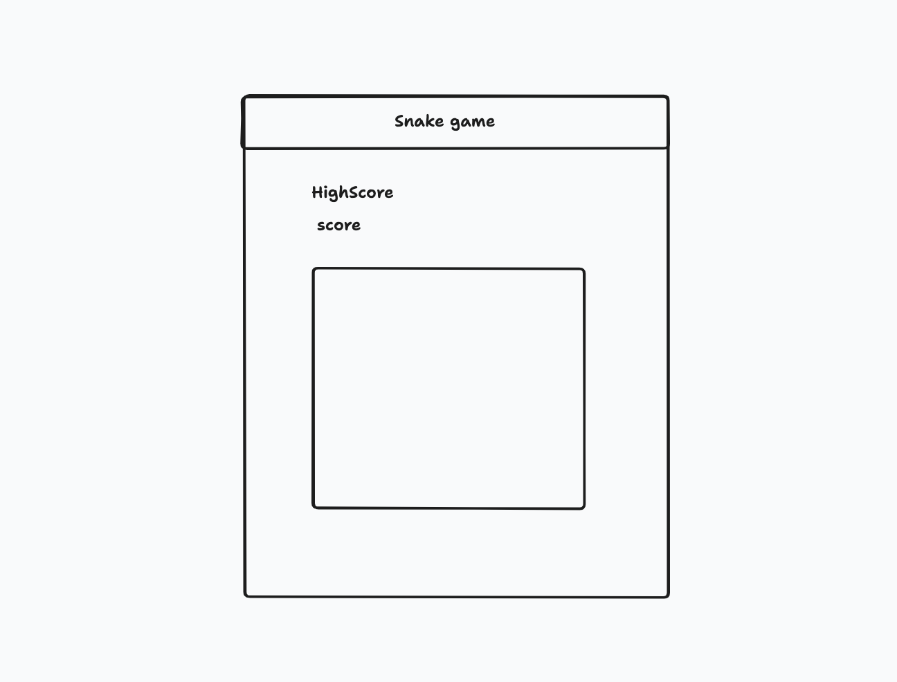

# GoalEase Snake Edition

## Authors: The East Code

-Steph G. Johnson
-David Grier
-Felix Taveras
-Ekow Yawson
-Latherio Kidd

## What is GoalEase Snake Edition?

### Summary of Idea:
GoalEase Snake Edition is an innovative fusion of goal management within the comprehensive GoalEase platform and classic snake gameplay. In this adaptation, the snake represents segmented goals or tasks within the GoalEase ecosystem, offering a playful and engaging way for users to visualize, interact with, and progress through their objectives.

### GoalEase Description:
GoalEase is an all-in-one goal management platform designed to streamline the creation, tracking, and modification of personal objectives. It offers error handling, robust database connectivity, and fundamental CRUD functionalities, ensuring an intuitive and efficient user experience. By incorporating GoalSnake into GoalEase, the platform further gamifies the goal-setting process, fostering improved productivity and goal attainment in a playful manner.

### GoalSnake Description:
GoalSnake is the gamified component within GoalEase Snake Edition. Each segment of the snake represents a goal or task, and players interact with their goals through classic snake gameplay. The integration adds a dynamic layer to traditional goal management, providing users with a unique and entertaining approach to achieving their objectives.

## [User Stories](https://github.com/TheEastCode/Client_301/wiki/User-Stories)

## Wireframe

